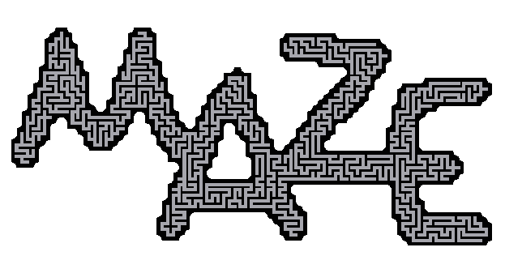
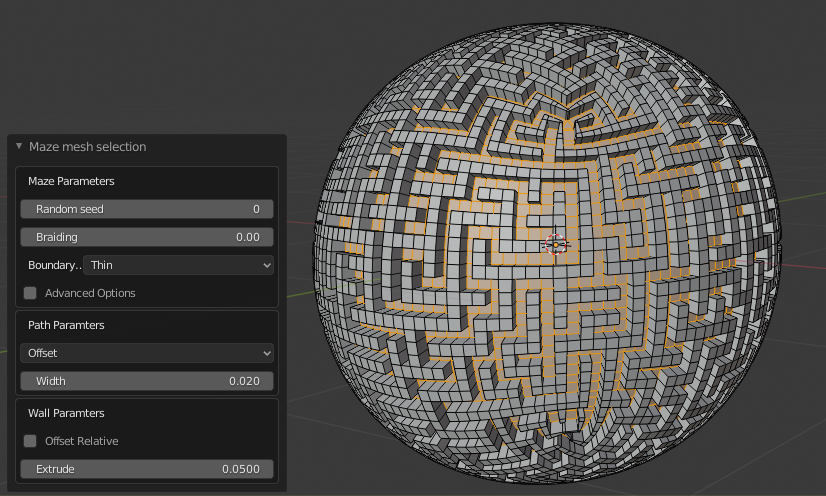
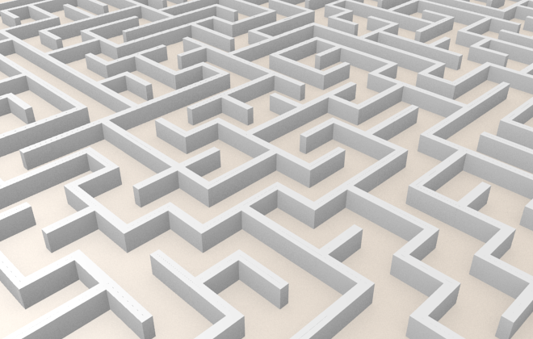
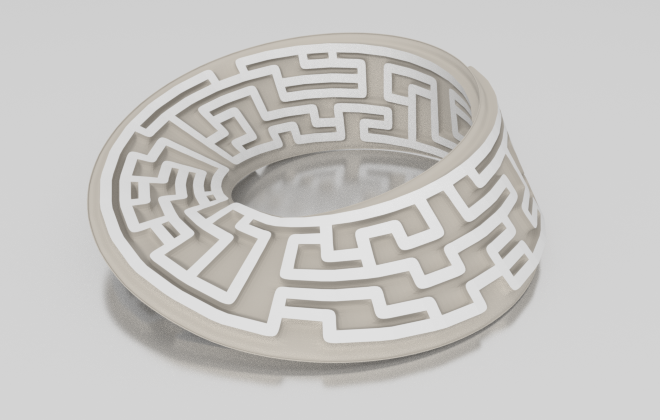
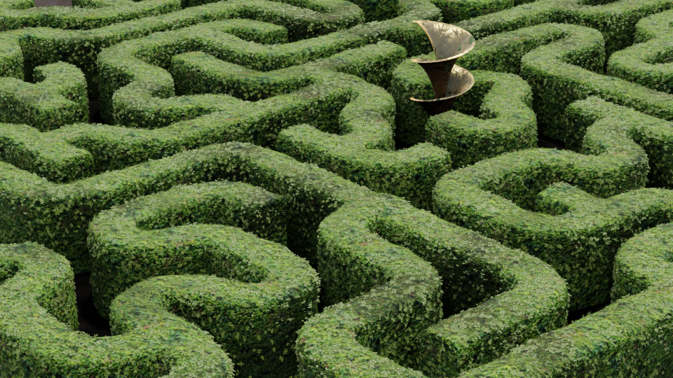

This add-on has been updated to Blender 2.9 in the master branch (tested on 2.90.0), the Blender 2.7 version is now in a separate branch.

This [Blender](https://www.blender.org/) add-on runs a recursive back tracker maze algorithm over the selected part of any mesh to produce a maze.

A Blender mesh structure can be seen as equivalent to the grid of cells and list of links used as the data structure for 2D mazes (for example by [Jamis Buck](http://weblog.jamisbuck.org/2011/2/7/maze-generation-algorithm-recap) in his book "Mazes for Programmers").

Here the mesh vertices are equivalent to cells and the mesh edge connections define the cell neighbors. A maze carving function can then return a subset of the edges that define the path of a maze through the mesh.

I originally realized this concept as a scripted node for the [Sverchok](http://nikitron.cc.ua/sverchok_en.html) add-on but have now completely rewritten the code into this separate standalone add-on for Blender.

The add-on can be installed in the normal way by downloading the zip file from the [github repository](https://github.com/elfnor/mesh_maze), then `Edit -> User Preferences -> Add-ons -> Install from File...`

Once installed and enabled the add-on can be found in *Edit Mode* on the *Mesh* menu, or using the `F3` menu to search for *maze*.

After carving the maze along the edges, the add-on (by default) bevels all the edges in the selection to give the maze path some width and then extrudes the walls of the mesh outward to give the maze some height.

## Maze Parameters

Changing the *Random Seed* parameter will recalculate a different maze on the same selection.

The *Braid* defines whether the maze has dead ends. The higher the value of *Braid* the less dead ends and the more loops or alternative paths in the maze.

The *Boundary Wall Type* is only applicable if part of the mesh is selected to run the maze on, or the mesh has a boundary (for example a grid mesh). This parameter sets the outer wall of the maze to *Thin*, *Thick* or *None*.

*Advanced Options* adds some extra parameters to the Path and Wall Parameters that effect the bevel and extrude operators.

## Path Parameters

*Bevel Amount Type* sets how the amount slider effects the bevel or path width. See the [bevel operator]() documentation for details.

The *Path Width* sets the width of the path. If set to zero only the edges of the maze within the original mesh are selected, no bevel or extrude takes place.

The *Clamp Overlay* and *Loop Slide* parameters are passed straight to the [bevel operator]().

## Wall Parameters

*Offset Relative* - scales the offset relative to the surrounding geometry.

*Extrude* - gives the height of the maze walls.

*Offset Even* - scales the offset to give more even thickness to the top width of the walls.

*Thickness* - narrows the top of the wall to give a tapered profile.

*Outset* - if the walls are tapered the tapered part extends into the path area.

## Large meshes

The mesh maze add-on takes about 8 seconds (on my machine) to generate a maze on an icosphere with ~10 000 vertices. It has been optimized so that the maze path is regenerated if the random seed or braiding values are changed but not for changes to the path width or wall height.

